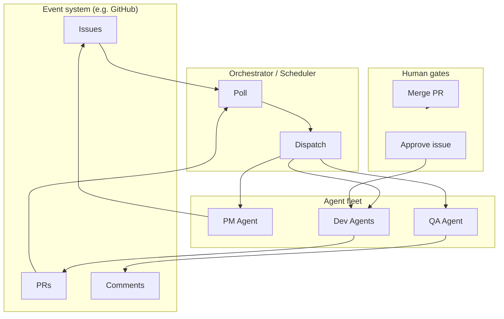
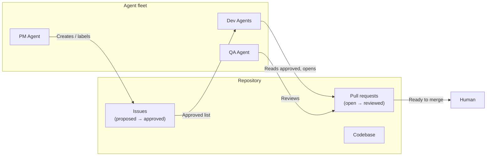
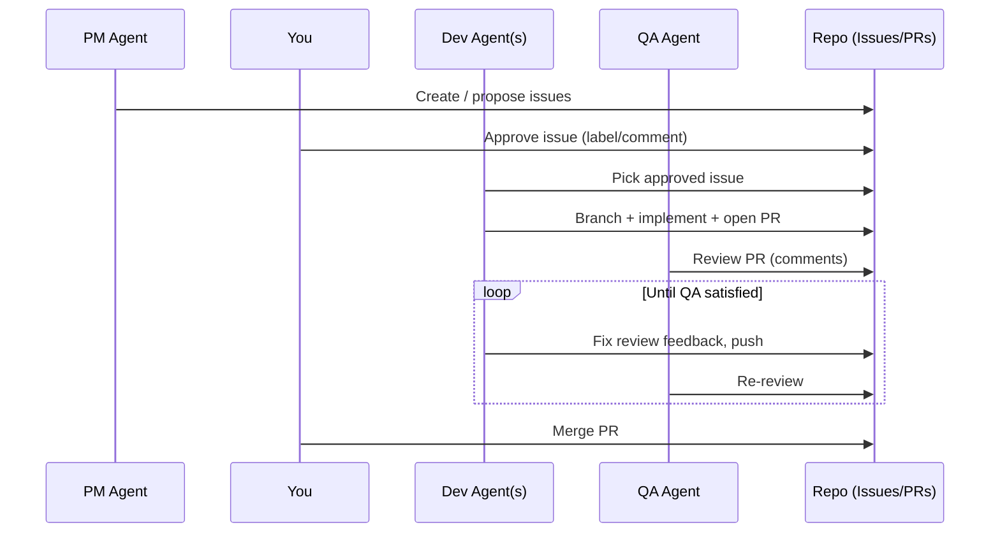
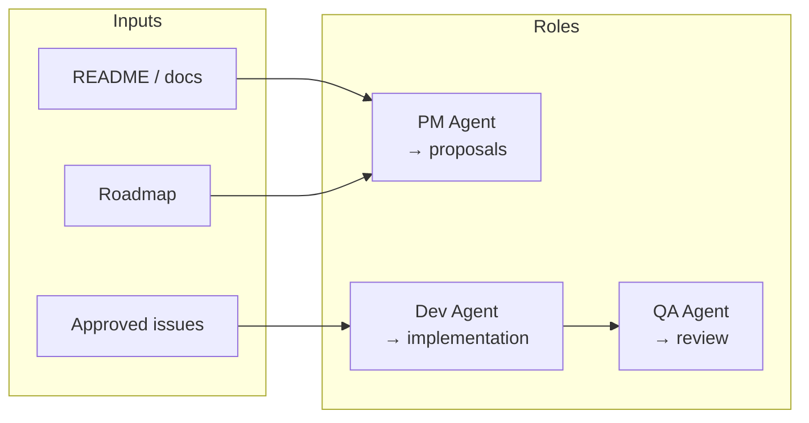
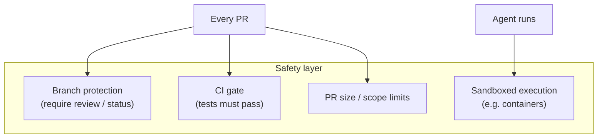
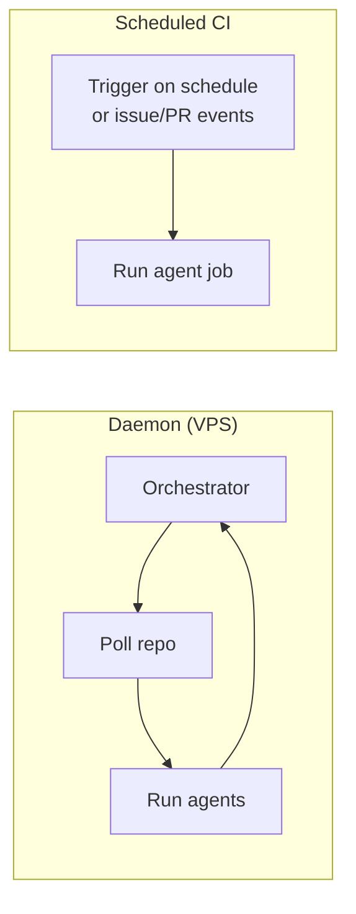

# Autonomous Agent Fleet: Architecture & Design

A design document for planning a **multi-agent autonomous development loop** with **gated human approvals**. The system runs continuously around a repository; you stay in control via issue approval and PR merge.

---

## Goals

| Goal | Description |
|------|-------------|
| **Autonomous execution** | Agents propose, implement, and review work without constant human intervention. |
| **Gated approvals** | Humans approve which work is done (issues) and what ships (PRs). |
| **Repository as source of truth** | Issues, PRs, and code live in the repo; all automation is event- and state-driven. |
| **Continuous operation** | A persistent layer runs agents on a schedule or in response to events. |

---

## What You Need (Agnostic Overview)

Three layers are required:

1. **Event system** — Issues, PRs, comments (e.g. GitHub, GitLab, or similar).
2. **Persistent runners** — A service or job that keeps polling/triggering and dispatching work.
3. **LLM workers** — One or more coding engines that execute tasks (any CLI/API that can edit code from prompts).

The rest of this document describes how these pieces fit together in an agent fleet with gated approvals.

---

## High-Level Architecture

---

## Repository as Source of Truth

All work is driven by repository state: issues (with labels/status) and pull requests.

---

## Agent Loop with Gated Approvals

The loop is **autonomous** between gates; **you** control what gets built and what gets merged.

**Gates:**

- **Gate 1 — Issue approval:** Only issues you approve (e.g. label `approved`) are picked up by dev agents.
- **Gate 2 — PR merge:** Only you (or your rules) merge; agents never merge.

---

## Agent Roles (Agnostic)

| Role | Responsibility | Trigger | Output |
|------|----------------|---------|--------|
| **PM Agent** | Propose scope and prioritization | Schedule or manual | New/updated issues (e.g. label `proposed`) |
| **Dev Agent(s)** | Implement approved work | Approved issues (label + open) | Branch, commits, PR |
| **QA Agent** | Review PRs for quality and policy | New/updated PR | Review comments, status (pass/fail) |

---

## Safety Mechanisms

Autonomous coding must be constrained. Recommended controls:

| Mechanism | Purpose |
|-----------|---------|
| **Branch protection** | No direct push to main; PR required; optional required reviews. |
| **Test gate** | CI must pass before merge (and before human approval). |
| **PR size / scope limits** | Reject or flag PRs over a certain size to keep reviews manageable. |
| **Sandbox** | Agents run in isolated environments (e.g. Docker) so they cannot affect host or secrets. |

---

## Deployment Options (Overview)

| Option | Pros | Cons |
|--------|------|------|
| **Persistent daemon (VPS / server)** | Full control, 24/7, parallel agents, simple mental model. | You operate the server. |
| **Scheduled CI (e.g. cron-style jobs)** | No server to maintain, event-driven. | Less flexible than a daemon; job limits and timeouts. |
| **Hybrid** | Critical loops on daemon, heavy/rare jobs on CI. | Two systems to configure. |

---

## Summary: What You Need

1. **Event system** — Issues and PRs (and optionally comments) as the interface.
2. **Orchestrator** — Polls or reacts to events and dispatches to the right agent.
3. **PM agent** — Proposes work; you approve by labeling or commenting.
4. **Dev agent(s)** — Implement only approved issues; open PRs, fix QA feedback.
5. **QA agent** — Reviews PRs and posts comments; no merge.
6. **Gates** — You approve issues and merge PRs; agents never merge.
7. **Safety** — Branch protection, CI, optional size limits, sandboxed runs.

The document above is **tool-agnostic**: it applies to any event backend (e.g. GitHub, GitLab), any runner (VPS, Kubernetes, serverless), and any LLM-based coding engine.

---

## Possible Solutions (Concrete Options)

This section lists **example** ways to implement the architecture; the rest of the document does not depend on these.

| Approach | Event system | Runner | LLM worker | Notes |
|----------|--------------|--------|------------|--------|
| **GitHub + VPS + Codex CLI** | GitHub (issues, PRs) | Python/Node daemon on VPS | OpenAI Codex CLI | Full control; Codex runs in containers or on host. |
| **GitHub Actions only** | GitHub | Actions on `schedule` + `issues` / `pull_request` | Codex API or another API | No VPS; constrained by Actions limits and timeouts. |
| **GitHub + Fly.io / Railway** | GitHub | Small app on Fly/Railway | Any HTTP/CLI coding API | Managed “daemon” without managing a raw VPS. |
| **GitLab + self-hosted runner** | GitLab (issues, MRs) | GitLab CI + runner | Any CLI/API | Same idea as GitHub + Actions, with GitLab semantics. |
| **Custom event bus** | Your own queue (e.g. SQS, Redis) | Workers consuming queue | Any | Maximum flexibility; you define events and triggers. |

**Codex-specific note:** The OpenAI Codex desktop app is an interactive assistant and does not run as a persistent background agent. For an autonomous fleet, use the **Codex CLI or API** from your orchestrator/runner so that agents can execute coding tasks in a headless, scripted way.

Choosing among these is a matter of where your repo lives, how much you want to operate (VPS vs managed), and which LLM coding engine you use; the architecture and gated-approval flow stay the same.
