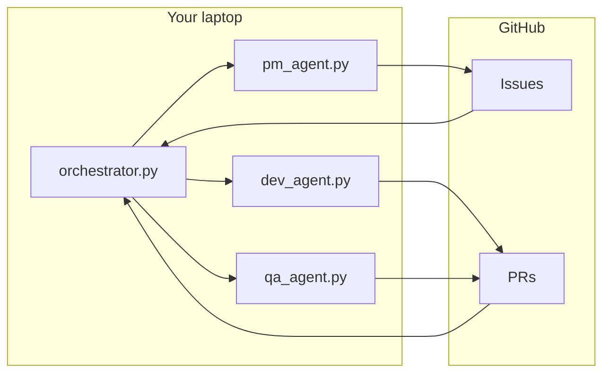

# Plan: GitHub + local laptop + Codex CLI

How to run an **autonomous agent fleet with gated approvals** on your laptop. Architecture is in [README.md](../README.md).

---

## Stack Summary

| Layer | Choice |
|-------|--------|
| Event system | GitHub (issues, PRs, comments) |
| Runner | Daemon on your laptop |
| LLM worker | OpenAI Codex CLI |

You run one orchestrator process locally; it polls GitHub and runs PM, Dev, and QA agents. You approve issues and merge PRs. Agents run whenever the laptop is on (e.g. overnight).

---

## Prerequisites

Before building:

1. **GitHub repo** — The repo you want the fleet to work on. Needs Issues and Pull Requests enabled.
2. **Codex CLI** — Installed and working (`codex` on PATH). You need the CLI (or API), not only the desktop app, so agents can run headless.
3. **Git** — Clone of the repo on your machine; orchestrator will run commands in that clone.
4. **Python 3** (or Node) — To implement the orchestrator and agent scripts. This plan assumes Python; adapt if you use Node.
5. **GitHub token** — Fine-grained or classic PAT with `repo` (issues, PRs, contents, commit statuses). Store as `GITHUB_TOKEN` env var or in a config file the daemon can read.

Optional but recommended: **Docker** (to run Codex/agents in a sandbox); **prevent sleep** so the laptop stays awake when you want the fleet running (e.g. overnight).

---

## What You Build

| Component | Responsibility |
|-----------|-----------------|
| **Orchestrator** | Loop: poll GitHub every N minutes → run PM → run Dev agents → run QA → sleep. Tracks "in progress" to avoid duplicate work. |
| **PM agent** | Read repo context (README, roadmap); call Codex to propose features; create GitHub issues with label `proposed`. |
| **Dev agent** | Find issues with label `approved` and open; for each (or one): create branch, run Codex to implement, push, open PR. |
| **QA agent** | Find open PRs (e.g. without "QA done" label); run Codex to review diff; post review comments; add label when done. |

Prompts for each agent live in `prompts/` (e.g. `pm.md`, `dev.md`, `qa.md`). The orchestrator or each agent script invokes Codex CLI with the right prompt and context.



---

## Repo Layout (Target)

```
repo/
├── orchestrator/
│   ├── orchestrator.py    # Main loop: poll, dispatch, sleep
│   ├── pm_agent.py        # Propose issues
│   ├── dev_agent.py       # Implement approved issue → PR
│   ├── qa_agent.py        # Review PR, post comments
│   ├── github_client.py   # Thin wrapper: list/create issues, PRs, comments, labels
│   └── config.py          # Poll interval, repo path, token env var name
├── prompts/
│   ├── pm.md
│   ├── dev.md
│   └── qa.md
├── plans/
├── ARCHITECT.md
└── README.md
```

Optional: `docker/` with a Dockerfile so Codex runs inside a container; orchestrator still runs on the host and triggers `docker run ... codex ...`.

---

## GitHub Setup

1. **Labels** — `proposed` (PM created; awaiting your approval); `approved` (Dev agents may pick up); `in-progress` (optional); `qa-done` (optional).
2. **Branch protection (main)** — Require a PR to merge; require status checks (CI) if you have it; do not allow the bot/user that pushes from the laptop to bypass.
3. **Token** — Create a PAT; give it to the orchestrator via `GITHUB_TOKEN` or config. Never commit the token.

---

## How the Daemon Runs Locally

1. **Clone the repo** (if not already): `git clone https://github.com/<you>/<repo>.git` then `cd <repo>`.
2. **Install deps:** `pip install -r orchestrator/requirements.txt` (include at least PyGithub or httpx for GitHub API).
3. **Set token:** `export GITHUB_TOKEN=ghp_...`
4. **Run the orchestrator** from repo root: `python orchestrator/orchestrator.py`. Or with Docker: `docker compose -f docker/compose.yml up`.
5. **Keep laptop on** when you want the fleet active (e.g. overnight). Optionally disable sleep or use `caffeinate` (macOS).
6. **Your workflow** — PM creates issues with `proposed` → you review and add `approved` → Dev agents create PRs → QA reviews and comments → Dev fixes until QA is satisfied → you merge the PR.

---

## Implementation Phases

| Phase | What to do |
|-------|------------|
| **1. GitHub client** | `github_client.py`: list issues by label, create issue, create branch, create PR, list PRs, post review comments, add/remove labels. Use PyGithub or REST. |
| **2. Config** | `config.py` (or env): repo path, `GITHUB_TOKEN`, poll interval (e.g. 300s), repo owner/name. |
| **3. PM agent** | Read README/roadmap; build prompt; call `codex run "..."` or `codex exec --prompt-file prompts/pm.md`; parse output and create issues via GitHub client; label `proposed`. |
| **4. Dev agent** | List issues with `approved` and open; pick one; checkout new branch; run Codex with issue title/body and `prompts/dev.md`; commit and push; open PR. Optionally add `in-progress` / remove when done. |
| **5. QA agent** | List open PRs (optionally without `qa-done`); for each, get diff; run Codex with `prompts/qa.md`; post comments via API; add `qa-done` when satisfied. |
| **6. Orchestrator loop** | `while True`: run PM, then Dev (once or N times), then QA; `time.sleep(interval)`. Add simple locking or "in progress" state so one dev agent doesn't pick the same issue. |
| **7. Safety** | Run Codex in Docker if possible; branch protection and CI as in ARCHITECT.md. |

Start with phases 1–2, then 3 (PM). Once you can approve an issue and see a PR (phase 4), add QA (5) and the loop (6).

---

## Codex CLI Usage (Reference)

```bash
# From repo root
codex run "Implement GitHub issue #42. See issue body for acceptance criteria. Follow existing code style and add tests."
# Or with a prompt file:
codex exec --repo . --prompt-file prompts/dev.md
```

The prompt file can include placeholders (e.g. issue number) that the orchestrator fills before calling Codex.

---

## Checklist Before Going "Live"

- [ ] GitHub token set and not committed.
- [ ] Labels `proposed` and `approved` exist; workflow for you to approve issues is clear.
- [ ] Branch protection on default branch; you are the only one who can merge (or your policy).
- [ ] Orchestrator runs in a terminal or as a background service; laptop stays awake when you want it (e.g. overnight).
- [ ] Prompts (pm.md, dev.md, qa.md) enforce "no merge by agent" and reference repo conventions.

---

## Summary

| Step | Action |
|------|--------|
| 1 | Install Codex CLI; create GitHub PAT; clone repo. |
| 2 | Add `orchestrator/` and `prompts/`; implement GitHub client + config. |
| 3 | Implement PM → Dev → QA agents (each calling Codex); then orchestrator loop. |
| 4 | Configure GitHub (labels, branch protection); run `python orchestrator/orchestrator.py` on your laptop. |
| 5 | Approve issues and merge PRs; let the fleet run when the laptop is on. |

For architecture and safety details, see [ARCHITECT.md](../ARCHITECT.md).
