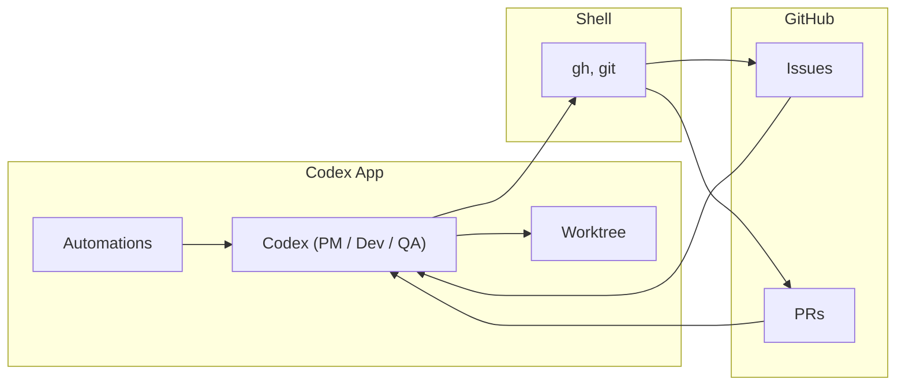

# Plan: GitHub + local laptop + Codex App

How to run an **autonomous agent fleet with gated approvals** on your laptop using the **Codex App**. Architecture is in [README.md](../README.md).

---

## Why the Codex App

The [Codex App](https://developers.openai.com/codex/app) is the main surface for this setup:

- **[Automations](https://developers.openai.com/codex/app/automations/)** — Schedule recurring tasks (e.g. “run one PM → Dev → QA round”). Runs happen in the background; findings show up in the **Triage** inbox. You can combine automations with [skills](https://developers.openai.com/codex/skills) (`$skill-name`).
- **[Worktrees](https://developers.openai.com/codex/app/worktrees)** — For Git repos, automations can run on a **dedicated worktree** so background work doesn’t touch your local checkout. You can also start threads on a worktree manually and use **Handoff** to move work between Local and Worktree.

The App must be running and the project available on disk. No custom daemon or GitHub API client—Codex uses the **`gh` CLI** in the shell for all GitHub actions.

---

## Stack Summary

| Layer | Choice |
|-------|--------|
| Event system | GitHub (issues, PRs, comments) |
| Runner | **Codex App** — Automations (scheduled) + Worktrees (isolation) |
| LLM worker | OpenAI Codex |
| GitHub access | **`gh` CLI** — Codex runs `gh` and `git` in the shell |

You open the repo as a project in the Codex App, add one or more **Automations** with a schedule and a prompt (or skill) that runs the PM → Dev → QA flow using `gh`. Automations run on a **worktree** so they don’t modify your local branch. You approve issues and merge PRs; the fleet runs whenever the App is running (e.g. overnight).

---

## Prerequisites

Before building:

1. **GitHub repo** — The repo you want the fleet to work on. Issues and Pull Requests enabled.
2. **Codex App** — Installed and running. The project must be **on disk** and **added as a project** in the App (e.g. open the folder / clone into a path the App can see).
3. **Git** — Clone of the repo on your machine (the App uses this clone; automations use worktrees created from it).
4. **`gh` CLI** — Installed and authenticated (`gh auth login`). Codex will run `gh issue list`, `gh pr list`, `gh pr create`, `git pull`/`git push`, etc., in the shell. Ensure the account has `repo` (or fine-grained equivalent).

Optional: **prevent sleep** when you want the fleet running (e.g. overnight); **sandbox settings** in the App (Settings) so automations have the right permissions (e.g. workspace-write for file changes and network for `gh`/push).

---

## What You Build

| Component | Responsibility |
|-----------|-----------------|
| **Prompts or skills** | Define the PM/Dev/QA workflow; instruct Codex to use `gh` (and `git`) for all GitHub and version-control actions. |
| **Automations** | In the Codex App: create one or more automations for this project. Set **schedule** and **prompt** (or `$skill-name`). Choose **worktree** so runs don’t touch your Local checkout. |
| **PM** | Codex reads README/roadmap; proposes features; runs `gh issue create` with label `proposed`. |
| **Dev** | Codex runs `gh issue list --label approved`, picks one; creates branch in worktree, implements, `git push`, `gh pr create`. |
| **QA** | Codex runs `gh pr list`, gets diff (`gh pr diff`), reviews; `gh pr comment` or `gh pr review`; adds label `qa-done` when done. |

All GitHub interaction is **Codex calling `gh`** in the shell—no separate API client.



---

## Repo Layout (Target)

Keep prompts and skills in the repo so they’re versioned and shareable:

```
repo/
├── prompts/
│   ├── pm.md       # e.g. "Use gh to create issues with label proposed..."
│   ├── dev.md      # e.g. "Use gh issue list --label approved; implement one; gh pr create"
│   └── qa.md       # e.g. "Use gh pr list; review; gh pr review / gh pr comment"
├── skills/         # optional: e.g. $pm-round, $dev-round, $qa-round (Codex can load from repo)
├── plans/
├── ARCHITECT.md
└── README.md
```

In the App, **open this repo as the project**. Automations reference the same project; when they run on a worktree, Codex creates a worktree from your clone (under `$CODEX_HOME/worktrees`) and runs there.

---

## GitHub Setup

1. **Labels** — `proposed` (PM created; awaiting your approval); `approved` (Dev may pick up); `in-progress` (optional); `qa-done` (optional).
2. **Branch protection (main)** — Require a PR to merge; require status checks (CI) if you have it; do not allow the bot/user that pushes from the laptop to bypass.
3. **Auth** — `gh auth login` (or `GITHUB_TOKEN` for `gh`). Never commit tokens.

---

## How It Runs

1. **Clone the repo** (if not already): `git clone https://github.com/<you>/<repo>.git` and open that folder in the **Codex App** as the project.
2. **Authenticate `gh`**: `gh auth login` so `gh` can access the repo from the environment the App uses.
3. **Create an Automation** in the App (sidebar → Automations):
   - Select **this project**.
   - Choose **Worktree** so the automation runs in a background worktree, not your Local checkout.
   - Set **schedule** (e.g. every 6 hours or daily).
   - Set **prompt** to run one round, e.g. “Run one PM → Dev → QA round. Use `gh` for all GitHub actions. PM: propose issues with label `proposed`. Dev: pick one `approved` issue, implement, push, open PR. QA: review open PRs and add `qa-done` when done.” Or reference a skill: “Run $pm-round then $dev-round then $qa-round.”
4. **Keep the Codex App running** (and laptop on) when you want the fleet active (e.g. overnight). Optionally disable sleep or use `caffeinate` (macOS).
5. **Your workflow** — PM creates issues with `proposed` → you review and add `approved` → Dev creates PRs via `gh` from the worktree → QA reviews and comments → you merge the PR. Check **Triage** in the App for automation runs with findings.

---

## Worktrees and cleanup

- Automations that use **worktrees** don’t modify your Local branch; they run in a separate checkout under `$CODEX_HOME/worktrees`. Codex creates branches and pushes from there.
- Frequent schedules can create many worktrees. **Archive** automation runs you don’t need and avoid **pinning** runs unless you want to keep their worktrees. See [Worktrees](https://developers.openai.com/codex/app/worktrees) and [Worktree cleanup for automations](https://developers.openai.com/codex/app/automations/).

---

## Implementation Phases

| Phase | What to do |
|-------|------------|
| **1. App + project + `gh`** | Install Codex App; clone repo; open repo as project in the App. Install and auth `gh`. Confirm Codex can run shell commands (e.g. in a thread: “Run `gh issue list`”) and that prompts/skills tell Codex to use `gh` and `git` for GitHub and version control. |
| **2. PM** | Add prompt/skill: read README/roadmap; propose features; run `gh issue create --label proposed`. Test in a **thread on a worktree** (or Local) before scheduling. |
| **3. Dev** | Prompt/skill: `gh issue list --label approved --state open`; pick one; `git fetch`/`git pull`; `git checkout -b ...`; implement; `git add`/`commit`/`push`; `gh pr create`. Optionally `gh issue edit` to add `in-progress`. Test in a thread. |
| **4. QA** | Prompt/skill: `gh pr list`; for each (or without `qa-done`), `gh pr diff`; review; `gh pr comment` or `gh pr review`; add label `qa-done`. Test in a thread. |
| **5. One round** | Single prompt or skill that runs PM → Dev → QA in sequence. Optionally three separate automations (PM / Dev / QA) on the same or different schedules. |
| **6. Automation** | In the App, create an automation for this project; choose **Worktree**; set schedule and round prompt (or `$skill-name`). Confirm sandbox allows workspace write and network so `gh` and push work. |
| **7. Safety** | Branch protection and CI as in ARCHITECT.md; prompts/skills enforce “no merge by agent”; use workspace-write (or rules) as needed, not full access, for automations. |

Start with 1–2 (PM). Once you can approve an issue and see a PR (3), add QA (4), then the round (5) and automation (6).

---

## Codex + `gh` (Reference)

Codex runs `gh` and `git` in the shell. Example prompt fragments:

```bash
# List approved issues
gh issue list --label approved --state open

# Create issue with label
gh issue create --title "..." --body "..." --label proposed

# Create branch, push, open PR (in worktree or local)
git checkout -b fix/issue-42
# ... implement ...
git add -A && git commit -m "..." && git push -u origin fix/issue-42
gh pr create --title "..." --body "..."

# Review PR
gh pr list
gh pr diff <number>
gh pr review <number> --comment -b "..."
gh issue edit <number> --add-label qa-done
```

In the App, run these via a **thread** (manual) or an **Automation** (scheduled). For automations on Git repos, use **Worktree** so the run doesn’t touch your Local checkout.

---

## Checklist Before Going "Live"

- [ ] `gh` installed and authenticated; token not committed.
- [ ] Repo cloned and opened as a project in the Codex App.
- [ ] Labels `proposed` and `approved` exist; workflow for you to approve issues is clear.
- [ ] Branch protection on default branch; you are the only one who can merge (or your policy).
- [ ] Automation(s) created in the App; **Worktree** selected for Git repo; schedule and prompt (or skill) set.
- [ ] Sandbox (Settings) allows automations to write in workspace and use network for `gh`/push.
- [ ] Codex App (and laptop) stay running when you want the fleet (e.g. overnight).
- [ ] Prompts/skills enforce "no merge by agent" and reference repo conventions.

---

## Summary

| Step | Action |
|------|--------|
| 1 | Install Codex App and `gh`; clone repo; open repo as project in the App; `gh auth login`. |
| 2 | Add `prompts/` (and optional skills) that tell Codex to use `gh` for issues, PRs, pull, push, labels, comments. |
| 3 | Implement PM → Dev → QA as prompts/skills; test in App threads (optionally on a worktree). |
| 4 | Configure GitHub (labels, branch protection). In the App, create an automation: this project, **Worktree**, schedule, round prompt or skill. |
| 5 | Approve issues and merge PRs; check Triage for automation findings; keep the App running when the fleet should run. |

---

## Optional: CLI fallback

If you need headless or scripted runs (e.g. on a server without the App), you can still use the **Codex CLI** with the same prompts: `codex exec --repo . --prompt-file prompts/dev.md`. This plan is centered on the **App** (Automations + Worktrees); the CLI is an optional complement.
